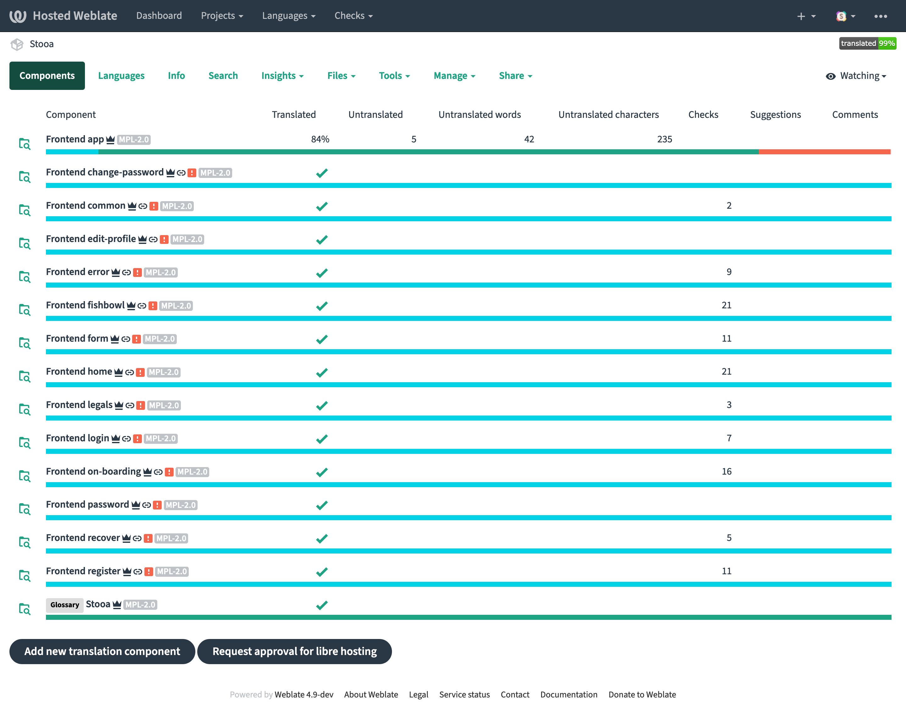
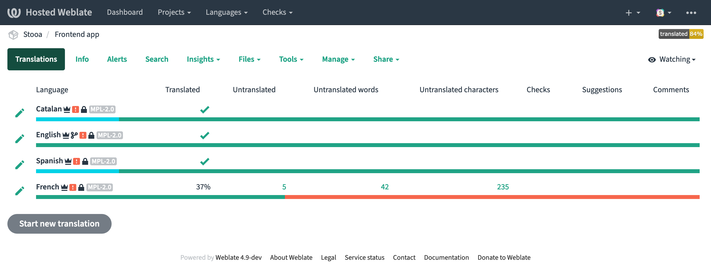
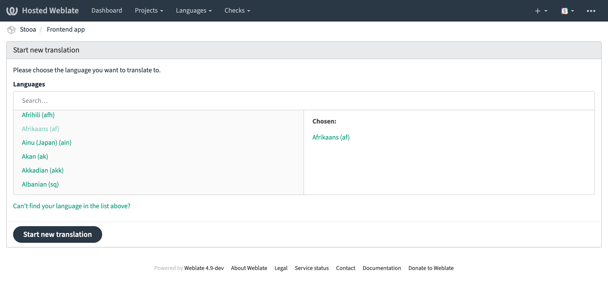
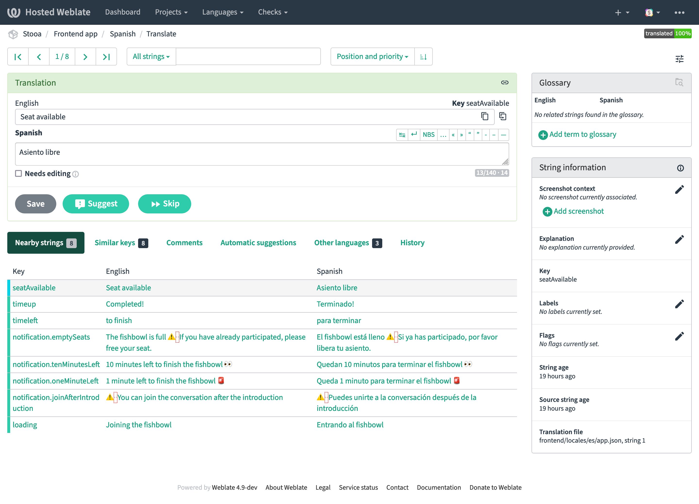
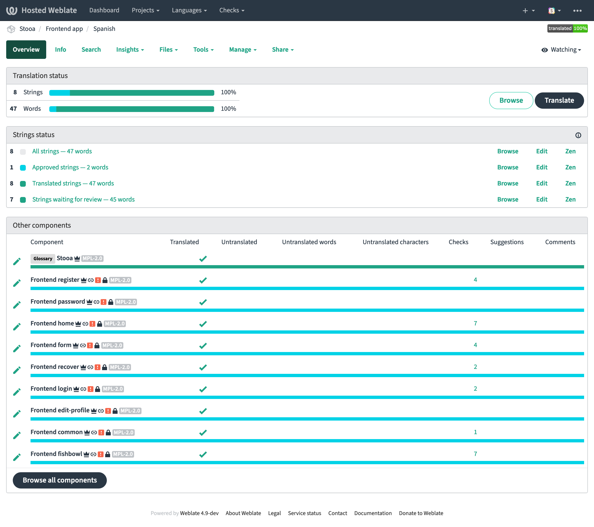

# Translations

Thank you for interest in contribute translating Stooa. Here you will find ways to do it.

## How to become a Stooa translator

We are using [Weblate as translation platform][weblate], so the first thing you need to be a Stooa translator is to have a Weblate account ([you can register here](https://hosted.weblate.org/accounts/register/)).

You also might want to take a look at the guide for [Translating using Weblate](https://docs.weblate.org/en/latest/user/translating.html).

## Add a new language

To add a language that is still not among the Stooa language options:

* Go to the [components list](https://hosted.weblate.org/projects/stooa/).
* Select the component you want to add the translation.
* Press the "Start new translation" button.
* Choose the language you want to translate to.
* Press the "Start new translation" button at the start new translation page.
* Start translating strings for the new language

## Add a new translation

To add a new translation (a string with a lacking translation for a certain language) follow the next steps:

* Go to the [components list](https://hosted.weblate.org/projects/stooa/).
* Select the component you want to add the translation.
* Click the edit button (pencil icon) close to the name of the language where you want to add the missing translation or translations.
* Find and select the translation's to complete.
* Complete the translation in the required input field.
* Press the "Save" button.
* Repeat the action with as many translation strings you can / you want

Saved new translations will automatically get the status "waiting for review". Our team will periodically check strings waiting for review and, if considered correct, will approve them.

## Change an approved translation

To edit an already approved translation string follow the next steps:

* Go to the [components list](https://hosted.weblate.org/projects/stooa/).
* Select the component you want to add the translation.
* Click the name of the language where is the translation you want to change.
* Click the Browse button.
* Find and select the translation's to complete.
* Change the translation in the input field.
* Press the "Save" button if you have permissions.

When collaborating with translations, Weblate will automatically create a Pull Request in the project repository with all translations added.

In the case of adding a new language, we will require a minimum of 80% of the translations between all project components for the Pull Request to be approved. Within this minimum, keep in mind that we will also require a 100% translation in the "Frontend - App" and "Frontend - Common" components.

Also keep in mind that the creation of a new language requires the action of the developers to integrate it into the app. A Pull Request for this development is also welcome :)

[weblate]: https://hosted.weblate.org/projects/stooa/
